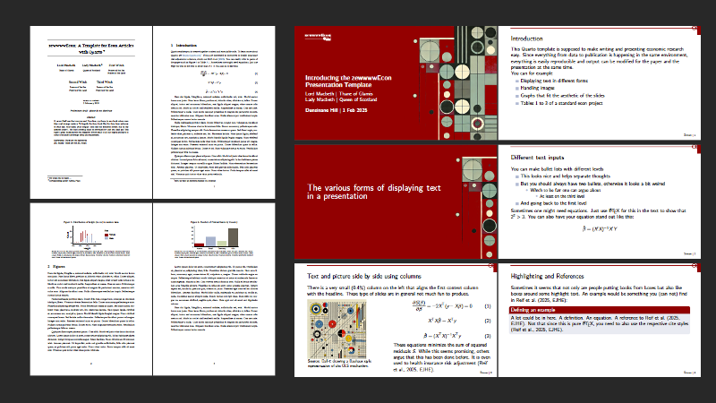
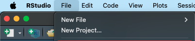
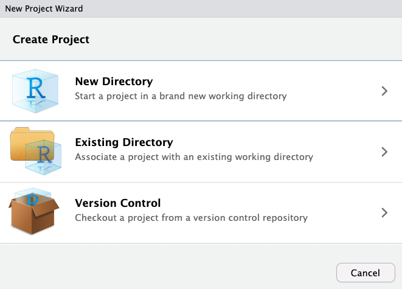
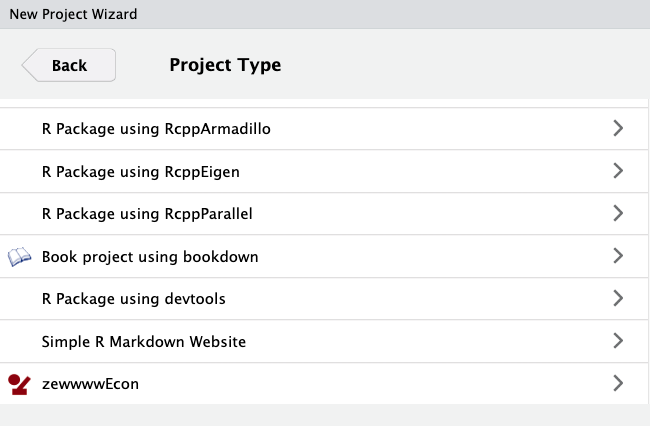
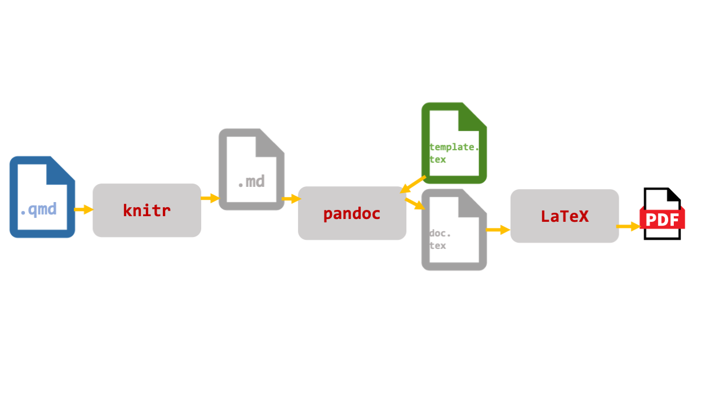

<!-- README.md is generated from README.Rmd. Please edit the Rmd file -->

# zewwww_econ Quarto Templates

The `zewwww_econ` package allows to start a new project in
<a href="https://posit.co/download/rstudio-desktop/"
target="_blank">RStudio</a> that contains the basic setup for an
empirical research project. It features
<a href="https://quarto.org/" target="_blank">Quarto</a> templates and
some `ggplot2` style adjustments to generate nice looking PDFs for
Slides and Paper in an environment that makes reproducibility easy. This
is an unbranded version to be shared on the `www` based on the
`zew_econ` package developed for internal use at the
<a href="https://www.zew.de/en/" target="_blank">ZEW - Leibniz Centre
for European Economic Research</a> in Mannheim, Germany. For a preview
of the PDF versions, have a lookt at the
<a href="../../blob/main/examples/FullProject/Paper/example_paper.pdf"
target="_blank">Paper</a> and
<a href="../../blob/main/examples/FullProject/Slides/example_slides.pdf"
target="_blank">Slides</a>.

<figure>

<figcaption aria-hidden="true">Paper</figcaption>
</figure>

## Motivation

While there are a lot of examples out there of how people use Quarto for
their empirical research projects we found no solution out there that
contains all the details required for the idiosyncrasies of applied
economics research output.[^1]

## Requirements and intended use

For the package to work properly,
<a href="https://cran.r-project.org/" target="_blank">R</a> (≥ 4.0),
<a href="https://posit.co/download/rstudio-desktop/"
target="_blank">Rstudio</a>,
<a href="https://quarto.org/docs/get-started/"
target="_blank">Quarto</a> (≥ 1.6) and
<a href="https://quarto.org/docs/output-formats/pdf-engine.html"
target="_blank">LaTeX</a> (e.g. TeX Live or tinytex, but definitely a
distribution that features XeLaTex) need to be installed.

## Installation

For those only interested in the details of our implementation, the
`examples` folder in this repository contains standalone documents for
<a href="../../blob/main/examples/Paper" target="_blank">Paper</a>,
<a href="../../blob/main/examples/Slides" target="_blank">Slides</a> and
the <a href="../../blob/main/examples/FullProject"
target="_blank">FullProject</a> setup. To have the full setup
automatically produced in the RStudio project wizard, please install the
package. The package can be installed in R using `devtools` (which you
need to install, in case you have not yet).

Option 1: Install from github

``` r
devtools::install_git("https://github.com/simonreif/zewwww_econ")
```

Option 2: Install a local `.zip` copy of the repository. This is useful
if you want to make changes to the package for yourself.

``` r
devtools::install_local("/Users/YOURPATH/thename.zip")
```

## Initiate a new project

After installing the package and restarting R Studio new projects can be
created in the project wizard. First select `New Project`.



You probably want to initiate the Project in a new directory.



The `zewwwwEcon` template should be somewhere down there.



You can then add the folder to GitHub by creating a <a
href="https://docs.github.com/en/migrations/importing-source-code/using-the-command-line-to-import-source-code/adding-locally-hosted-code-to-github#initializing-a-git-repository"
target="_blank">local git repository</a> and then adding the <a
href="https://docs.github.com/en/migrations/importing-source-code/using-the-command-line-to-import-source-code/adding-locally-hosted-code-to-github#adding-a-local-repository-to-github-using-git"
target="_blank">local repository to GitHub</a>.

## Project structure

When you initiate a project under the name `Project_Title` you get the
following folder structure:

    /Project_Title
    ├── A_Orig
    ├── B_Prog
    │   └── 0setup.R
    ├── C_Temp
    ├── D_Out
    ├── Paper
    │   └── Paper_TITLE.qmd
    │   └── zewwwwPaperTemplate.tex
    ├── Slides
    │   └── Slides_TITLE.qmd
    │   └── zewwwwSlidesTemplate.tex
    │   └── zewwwwImages
    ├── .lintr
    ├── .gitignore
    ├── Project_Title.Rproj
    ├── references.bib
    ├── Makefile

In the Paper and Slides folder, the `.qmd` files are the Quarto
documents to produce the respective output (you might want to replace
`TITLE` with some better name for your project). After you open a `.qmd`
file, it can be rendered to generate the output `.pdf` documents either
by using the `Render` button or by `CMD + Shift + k`. Under the hood,
Quarto uses `knitr` to turn code output into formats that can be used
for the final document (e.g. PDF files for graphs). Then an intermediate
markdown file is generated and taken up by `pandoc` which in turn uses
the intermediate markdown file and the respective `*template.tex` file
to produce a `LaTeX` document. This `LaTeX` document is then compiled to
the final PDF. The cool thing is: you do not need to worry about these
details since Quarto is taking care of everything.



### Intended flow of things

For a full working example of the project setup and codes, see the
`examples/FullProject` folder in this repository. The idea is:

- Raw data from `A_Orig` is used for data wrangling and estimations
  through scripts in `B_Prog`.
- Intermediate files are stored in `C_Temp` and the final output goes
  into `D_Out` as `.rds` files.
- The `.qmd` documents in `Paper` and `Slides` take the results from
  `D_Out` and integrate them in the final documents. Using `.rds` files
  here allows for final adjustments if outputs need to be different
  between slides and paper.
- `0setup.R` loads all packages needed in the project and defines the
  ggplot2 style.
- Each script sources the setup, but does not load any additional
  packages.
- Each script starts with a fresh environment and ends with an empty
  environment.

### YAML headers

The YAML header at the beginning of the `.qmd` document contains
information that is used either by Quarto to render the document or
pasted into the `tex` file from which the final PDF is generated. Most
of the entries are self-explanatory.

#### Options for Slides and Paper

- `pdf-engine:` Which LaTeX distribution to use. Everything works fine
  with `XeLaTeX` while other engines have caused problems.
- `cap-location:` While Quarto allows for figure and table captions to
  be at the bottom of the output, the very sensible default here is
  `top` since we have notes to write at the bottom.
- `add-tex:` We do automatically load the most common `TeX` packages in
  the template files. However, if you need something in addition or want
  to input some raw `TeX` in the document preamble, this is the space to
  do it.
- `editor:` Quarto has a `visual` editor that can be helpful. It can
  however also mess around with your code, so the default is `source`.

#### Options for Paper

- `affiliation:` This input is used to identify the corresponding
  author.
- `thanks:` Is for the acknowledgement note. We have separated this from
  the corresponding author note since usually all authors share the
  acknowledgement.
- `prelim-note:` Papers are often distributed at very early stages
  (e.g. for internal workshops) and you can print on the title page that
  you do not wish this version to get redistributed
- `number:` Usually the paper is not finished after the first release.
  You can use this to indicate the current iteration.
- `repohash:` When using git, you can print the last digits of the hash
  code for the current commit of the repository to be able to see how
  your code looked like for the specific version of the paper.

#### Options for Slides

- `presenter:` If you want your name to appear on every slide at the
  bottom right, add it here.
- `partner-logo:` This is a placeholder in case you want to add more
  logos on the title page.
- `totalnumber:` If `true` then the total number of slides in the
  presentation is printed next to the current slide number at the bottom
  right.
- `references:` If `yes` then a bibliography will get printed as the
  last slide(s).

### References

You can use the <a href="https://pandoc.org/MANUAL.html#citation-syntax"
target="_blank">pandoc syntax</a> for referencing, so `@key` is for text
cites and `[@key]` is for indirect references.
<a href="https://www.zotero.org/" target="_blank">Zotero</a> is well <a
href="https://quarto.org/docs/visual-editor/technical.html#citations-from-zotero"
target="_blank">integrated in Quarto</a>.

### Lintr

To produce consistent code,
<a href="https://lintr.r-lib.org/" target="_blank">lintr</a> and
<a href="https://github.com/r-lib/styler" target="_blank">styler</a> can
be a great tool. The package includes a `.lintr` file that takes the
<a href="https://style.tidyverse.org/" target="_blank">default tidyverse
linter</a> but loosens the line length restriction to 120.

### gitignore

We have tried to come up with a sensible default for the `.gitignore`
file. When working with sensitive data, it might be useful to add
`A_Orig` and `C_Temp` to `.gitignore` so that raw data is not
accidentally made public.

### Makefile

A makefile automates the execution of the full project. In the file, the
full flow from raw data to final output is specified. `make` checks
parts have changed and only executes those files and the files that
depend on them. When correctly specified, you can just type `make` in
the terminal and wait for the output to get updated. For a good
introduction to makefiles, see
<a href="https://third-bit.com/py-rse/automate.html"
target="_blank">here</a>. On Windows, you need to install
<a href="https://www.gnu.org/software/make/" target="_blank">GNU
Make</a> for the makefile to run.

## Implementation details

In designing the templates we made some decisions that we believe are
sensible but might cause problems.

### Template and Tex Files directly in project folder

Technically, Quarto allows for a way less cluttered project folder than
what we implement here. The template files could be stored at a central
place and the temporary `.tex` output could be deleted automatically by
Quarto. Our implementation has the advantages that 1) it is simple to
twist and 2) it is easier to debug things since everything is in one
place.

### TeX-Templates from scratch

- The workflow probably intended by the Quarto developers is to work on
  the baseline implementation that comes with Quarto and adjust the
  *parts* as needed
- Up to now it feels easier to twist everything from scratch (just
  change `template.tex`)
- **Caveats:** 1) There are things that generally work in Quarto that do
  not work with the templates (e.g. Callout Blocks). 2) When something
  changes for Quarto or R under the hood, the templates need to get
  updated manually.

### Use TeX fragments in markdown

- The beauty of Quarto via pandoc is that you can render any document
  into any format. This does not work if you use raw TeX.
- But: Arriving at desired PDF outputs is however often simpler using
  TeX
- **Future solution:** Use lua filters (e.g. figure notes)

### Clunky Fixes

All programs used in this template are still being developed and
therefore some things do not work as we wish by default. Therefore some
workarounds were implemented. They should not (but may) cause other
problems:

#### Notes for Figures and Tables

**Problem:** When notes are added as a minipage (directly via `LaTeX` or
indirectly via `gt`) then we must force `LaTeX` to run them next to each
other. Just adding a minipage below an output can lead to a series of
graphs followed by a series of graph notes.

**Solution:** All output is generated in a dedicated `:::` environment.
At the beginning, we define the label (`fig` / `tbl`) s.t. internal
referencing works in Quarto. Then comes the main output. For reasons…
then the very last text line in the `:::` environment is used as the
title of the Table or Figure.

#### Spacing between Notes and Figures or Tables

**Problem:** When notes are added as a `minipage` (directly via `LaTeX`
or indirectly via `gt`) then they appear directly with no space below
the output.

**Solution:** For the `LaTeX` code for the minipage below Figures, we
can just add `\vspace{}` to solve this. For table notes from `gt`, we
need to add an additional source note with an empty unicode character.
This empty source code then is displayed as some space below the Table
(<https://github.com/rstudio/gt/issues/1508>){target=“\_blank”}. As
output from `gt` is automatically put into a minipage and there is no
way to change the style there, the template defines the font size of all
minipage content to scriptsize. This means that if you want to use a
normal size minipage, you have to set normalsize in the beginning of
your minipage!

#### Caching in Quarto chunks

**Problem:** Caching in Quarto does not realize when a file that is
loaded into a chunk has changed. Since we normally create tables and
graphs in dedicated scripts and import the script output as `.rds` files
into the chunk, a change to the RDS file as a result of a code change in
the script will not get realized by the default caching option.

**Solution:** We cache the input `.rds` file in the chunk using its MD5
hash as `cache.extra=tools::md5sum('name_of_output.rds')`. This means
when the underlying file changes, the chunk is run. If the code is
unchanged the chunk is not re-run. An alternative would be to use
`file.mtime()`(<https://yihui.org/en/2018/06/cache-invalidation/>){target=“\_blank”}.

## Package development

This package is developed and maintained by Simon Reif and Benedikt
Stelter. We are grateful for the feedback from the early test users
Sabrina Schubert, Yasemin Karamik, Jan Köhler, Paul Peters and Theresa
Bolz. If you experience bugs, or have ideas on how to improve the
templates (functionality, examples, …), let us know via Email, Issues or
pull-request.

Our current plans for future development are:

- typst implementation

- Revealjs slides

- Word output for paper

These add-ons will require some work and coming up with specific lua
filters. So this will take some time. If you have cool ideas or want to
contribute, let us know!

[^1]: Examples are the
    <a href="https://quarto.org/docs/journals/formats.html"
    target="_blank">Journal templates</a> maintained by Quarto, the
    <a href="https://github.com/andrewheiss/hikmah-academic-quarto"
    target="_blank">Hikmah templates</a> by Andrew Heiss, the
    <a href="https://github.com/AaronGullickson/research-template/"
    target="_blank">research template</a> by Aaron Gullickson or the
    <a href="http://azimuth-project.tech/froggeR/index.html"
    target="_blank">froggeR</a> package by Kyle Grealis.
