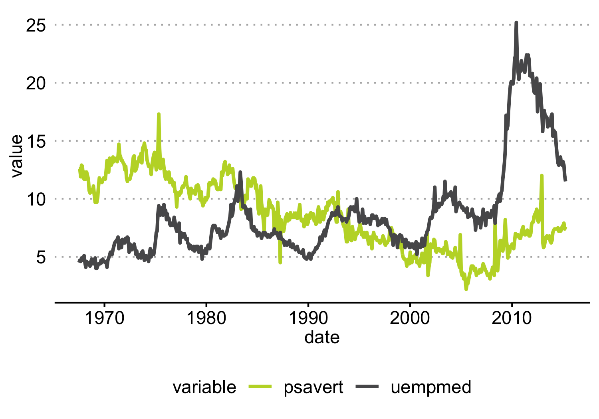
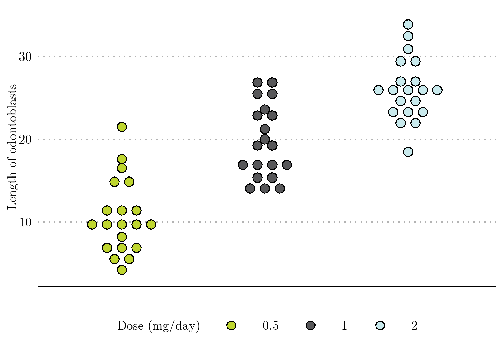
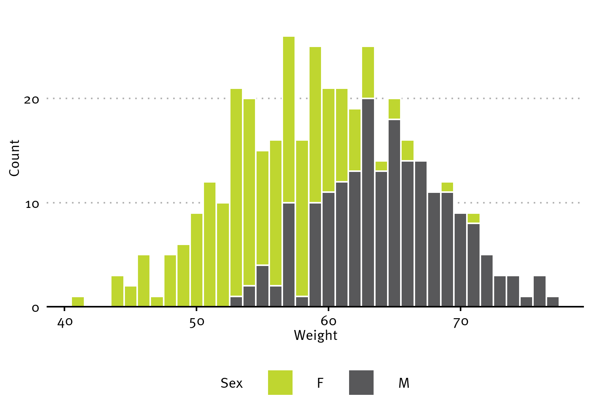
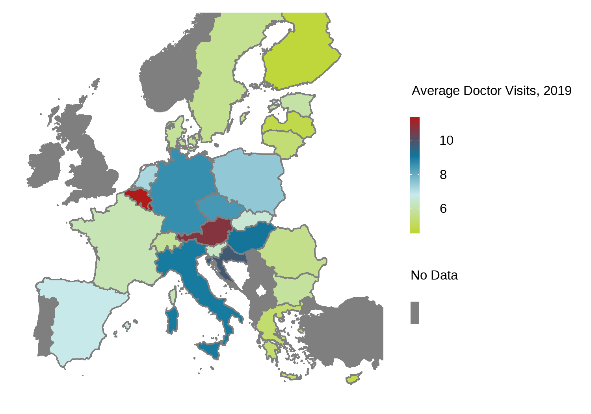
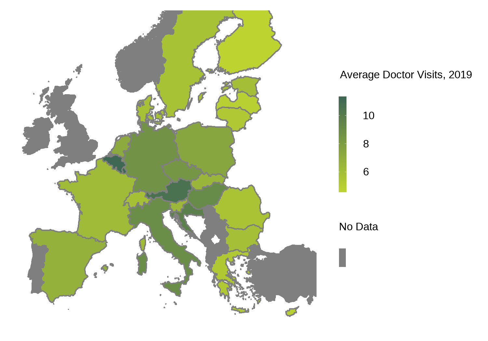

<!-- README.md is generated from README.Rmd. Please edit that file -->

# zewtemplates

The package `zewtemplates` implements document templates, a distinct
ggplot2 style for plots and coloring according to ZEW style guidelines
in RStudio.

## Installation

It is necessary to install the `devtools` package. Then, `zewtemplates`
can be installed either directly from git or locally from a downloaded
version of the package

``` r
install.packages('devtools')
library(devtools)

# Option 1: Install directly from "git.zew.de" (you will have to log in)
install_git("https://git.zew.de/F-STELTE/zewtemplates")

# Option 2: Install locally
install_local("insert path to file here")
```

To use the pdf templates, you will need to **download Quarto and
TinyTex**. No other things are required. Information on the installation
can be found here:  
<https://quarto.org/docs/get-started/>  
<https://quarto.org/docs/output-formats/pdf-engine.html>  
If you experience problems with the automatic installation of the
necessary LaTeX packages during the render process, reinstalling both
Quarto and TinyTex should fix the problem.

## Project development

If you want to make “global” improvements or bugfixes for the templates:
All the templates are stored in the directory
“inst/extdata/\_extensions”. The files can be found in the respective
subdirectories “skeleton”.

## Document templates

`zewtemplates` includes three pdf document templates in ZEW style:
Project report, paper and presentation slides. You have the choice
between project report and paper, **presentation slides are always
included**.

To use the templates, access the **New Project…** wizard. In the **New
Project…** wizard, choose **New Directory**. Then, select **ZEW
Template**:


When creating the project, a specific directory structure is created by
default, which is shown below:


Plots might be created in folder B and output into folder D. The plots
are then imported into the Quarto files. It is also possible to directly
render the Quarto files to pdf using the “0_master.R” script.

There is however no need do this! It is also possible to just use the
directory “Report” or “Slides” and create the plots directly in the
Quarto file.

Specific information on the use of each one of the templates can be
found in the respective Quarto files.

The quarto files in the folder “examples” provide further guidance.

## Setting up Git with new project

To use git with the new project: make a [local git
repository](https://docs.github.com/en/migrations/importing-source-code/using-the-command-line-to-import-source-code/adding-locally-hosted-code-to-github#initializing-a-git-repository)
and add the [local repository to
GitHub](https://docs.github.com/en/migrations/importing-source-code/using-the-command-line-to-import-source-code/adding-locally-hosted-code-to-github#adding-a-local-repository-to-github-using-git).

## Plot style and coloring

### Description

#### `theme_zew`

`theme_zew()` is a custom ggplot2 theme. The function takes four
arguments:

- `font`: Using this argument, a custom font can be selected (otherwise
  the default ggplot2 font will be used). The font has to be loaded
  using other packages first.
- `font_size`: Custom font size can be specified, default is
  `font_size = 11`.
- `flipped`: Boolean value that can be used to flip the axis design (see
  example), default is `flipped = FALSE`.
- `map`: Boolean value that indicates whether a “choropleth” map is
  plotted (only use `TRUE` in that case, otherwise not), default is
  `map = FALSE`.

Of course it is also possible to add custom theme elements and replace
theme elements from `theme_zew()`, by using the `theme()` function (see
<https://ggplot2.tidyverse.org/reference/theme.html> for details). When
the package `zewtemplates` is loaded, theme_zew becomes the default
theme, see the first plot as an example.

#### `scale_fill_zew` and `scale_color_zew`

`scale_fill_zew()` and `scale_color_zew()` bring the ZEW color palette
to ggplot2, based on `scale_fill_manual()` and `scale_color_manual()`.
The two functions take three arguments each:

- `palette`: Specifies the number of colors (minimum two, maximum eight
  colors) that are needed, e.g. when four colors are needed:
  `palette = "four"`; when six colors are needed: `palette = "six"`.
  Default is `palette = "two"`. In the case that a color gradient is
  needed (e.g. for choropleth maps), there are four options. Firstly,
  there is a specific `"gradient"` palette over four different ZEW
  colors. Use `palette = "gradient"` if you want to use this.
  Additionally, there are also three gradients over single colors
  (`"greens"`, `"blues"`, `"reds"`). To use them, e.g. set
  `palette = "greens"`.
- `discrete`: Boolean value that specifies whether the variable is
  discrete or whether a color gradient is required. Default is
  `discrete = TRUE`.
- `reverse`: Boolean value that can be used to change the order of the
  colors. Default value is `reverse = FALSE`.

#### Global color variables

On top of the palette function, the template defines the ZEW colors as
global variables. When plotting without a color palette (e.g. a line
plot with only one line), the hex codes of the colors therefore do not
have to be looked up when using the defined variables. The eight colors
have the following names:

- `zew_lightgreen`
- `zew_lightblue`
- `zew_red`
- `zew_darkblue`
- `zew_brown`
- `zew_yellow`
- `zew_grey`
- `zew_darkgreen`

See the following examples as well as the plots in the document
templates for clarification.

### Examples

``` r
library(zewtemplates)
#Plot
example_plot <- ggplot(df, aes(x = date, y = value)) + 
  geom_line(aes(color = variable), size = 1) +
  scale_color_zew()
```



It is also possible to select a custom font and change the font size
(default font size is 11) through the arguments `font` and `font_size`:

``` r
#Load custom font (e.g. Latin Modern Roman 10: "LaTeX Font")
library(showtext)
font_add(family = "Latin Modern Roman 10", regular = "Examples/lmroman10-regular-webfont.ttf")
showtext_auto()

#Plot
toogro <- ggplot(ToothGrowth, aes(x=dose, y=len, fill = dose)) +
  geom_dotplot(binaxis='y', stackdir='center',
               stackratio=1.5, dotsize=1.2) +
  labs(
    y = "Length of odontoblasts",
    fill = "Dose (mg/day)"
  ) +
  scale_fill_zew(palette = "three") +
  theme_zew(font = "Latin Modern Roman 10", font_size = 28) +
  theme(axis.title.x = element_blank(), axis.text.x = element_blank(), axis.ticks.x = element_blank())
```



You could also load the MetaPro font, which is the standard font of
ZEW’s corporate design:

``` r
#Load custom font (e.g. MetaPro)
font_add(family = "MetaPro", regular = "Examples/METAPRO-NORMAL.OTF")
showtext_auto()

#Plot
histo <- ggplot(df) + geom_histogram(mapping = aes(x=weight, fill=sex), color= "white", binwidth=1) + labs(
  x = "Weight",
  y = "Count",
  fill = "Sex") + scale_y_continuous(expand = expansion(mult = c(0, .1))) +
  theme_zew(font = "MetaPro", font_size = 28) + scale_fill_zew()
```



The following example shows a map with a color gradient. Let’s first use
the `gradient` palette:

``` r
#Plot
mapall2019 <- doc_visits_2019 %>%
  ggplot(aes(colour="", fill = nr_doctor_visits)) +
  geom_sf() +
  scale_x_continuous(limits = c(-10, 35)) +
  scale_y_continuous(limits = c(35, 65)) +
  theme_zew(map = TRUE, font_size = 25) + scale_fill_zew(palette = "gradient", discrete = FALSE) + labs(fill='Average Doctor Visits, 2019') +
  scale_colour_manual(values=NA) +
  guides(colour=guide_legend("No Data", order = 2, override.aes=list(fill="#7f7f7f")),
         fill = guide_colorbar(order = 1))
```



Let’s plot the same map using the `greens` palette:

``` r
#Plot
mapall2019_greens <- doc_visits_2019 %>%
  ggplot(aes(colour="", fill = nr_doctor_visits)) +
  geom_sf() +
  scale_x_continuous(limits = c(-10, 35)) +
  scale_y_continuous(limits = c(35, 65)) +
  theme_zew(map = TRUE, font_size = 25) + scale_fill_zew(palette = "greens", discrete = FALSE) + labs(fill='Average Doctor Visits, 2019') +
  scale_colour_manual(values=NA) +
  guides(colour=guide_legend("No Data", order = 2, override.aes=list(fill="#7f7f7f")),
         fill = guide_colorbar(order = 1))
```



For more examples of the usage of `theme_zew()`, `scale_color_zew()` and
`scale_fill_zew()`, see the plots in the respective example slides,
paper and report in the folder “examples”. The code is stored in the
respective quarto files.
