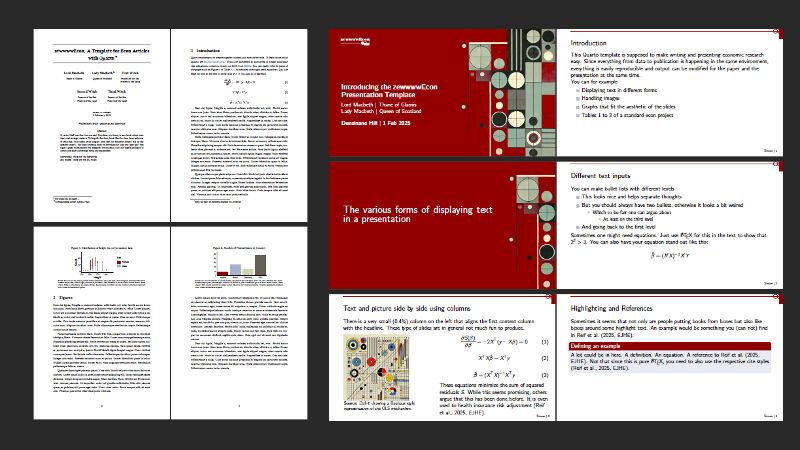
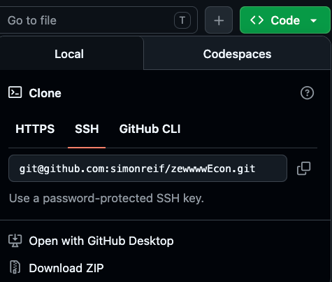
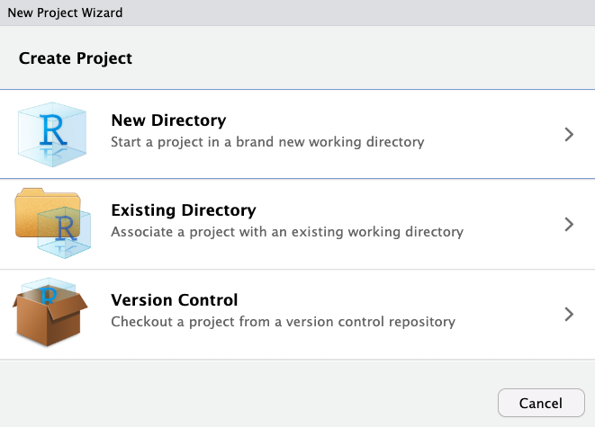
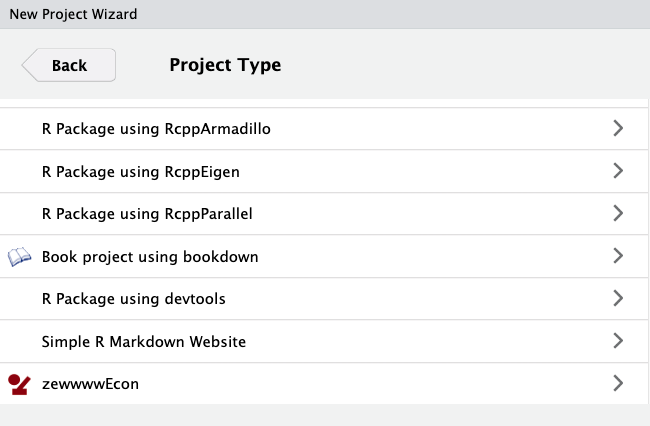
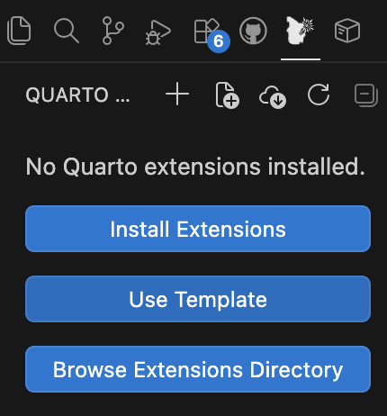
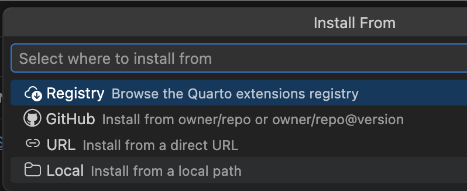
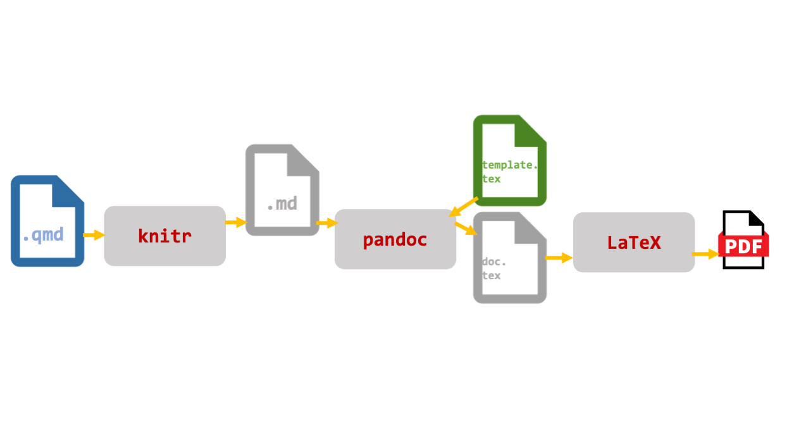

# zewwwwEcon Quarto Templates 

The `zewwwwEcon` package allows to set up new projects for reproducible empirical research using [Quarto](https://quarto.org/). A project contains templates and some `ggplot2` style adjustments to generate PDFs for Slides and Papers. This is an
unbranded version to be shared on the `www` based on the `zewEcon` package developed for internal use at the [ZEW - Leibniz Centre for European Economic Research](https://www.zew.de/en) in Mannheim, Germany. For a preview of the PDF versions, have a look at the
[Paper](https://github.com/simonreif/zewwwwEcon/blob/main/examples/FullProject/Paper/example_paper.pdf) and [Slides](https://github.com/simonreif/zewwwwEcon/blob/main/examples/FullProject/Slides/example_slides.pdf) examples.



## Motivation

While there are a lot of examples out there of how people use Quarto for their empirical research projects we found no solution out there that contains all the details required for the idiosyncrasies of applied economics research output.[^1]

[^1]: Examples are the [Journal templates](https://quarto.org/docs/journals/formats.html) maintained by Quarto, the [Hikmah templates](https://github.com/andrewheiss/hikmah-academic-quarto) by Andrew Heiss, or the [research template](https://github.com/AaronGullickson/research-template/) by Aaron Gullickson. There is also the excellent [econ-project-template](https://econ-project-templates.readthedocs.io) by Hans-Martin von Gaudecker, Tim Mensinger, Tobias Raabe and Max Jahn which provides a full Python setup and a lot of cool features but has less focus on the design of final outputs.

## Requirements

### Necessary

- [Quarto](https://quarto.org/docs/get-started/) (≥ 1.7) 
- [LaTeX](https://quarto.org/docs/output-formats/pdf-engine.html) (e.g. TeX Live or tinytex, but definitely a distribution that features XeLaTex) need to be installed.

### Recommended

- All examples are tested using [R](https://cran.r-project.org/) (≥ 4.5). This package can also be used within R to set up the structure for new projects.
- On Windows, [GNU Make](https://www.gnu.org/software/make/) is needed for the makefile to run.


### Additional features

- [VSCode](https://vscodium.com/) / [Positron](https://positron.posit.co/) for snippets to work.
- [Nix](https://docs.ropensci.org/rix/articles/getting-started.html) can be used to set up reproducible environments here. The environment is defined using the excellent [Rix](https://docs.ropensci.org/rix/) package.  


## Try out the examples

### Individual documents

A first step into using the templates can be to just play around with the examples. After cloning or downloading and unzipping this repository, the examples should work out of the box.

A first step can be to render the standalone examples: 

- `examples/Paper` contains `example_paper_solo.qmd`
- `examples/Slides` contains `example_slides_solo.qmd`

All of them can be either run from within RStudio or VSCode/Positron. When the `*.qmd` file is open there, press `Shift + Cmd + k` (Mac) or `Shift + Ctrl + k` (Windows) and the output `*.pdf` will get created.

Alternatively, Quarto also works directly from the Terminal using `quarto preview example_XXX_solo.qmd` when inside the respective folder.

### Full project example

A full project example is in `examples/FullProject`. The `*qmd` files in the Paper, Report, and Slides subdirectories can be rendered only when the full data science pipeline is executed. This means all scripts in `B_Prog` need to get executed to create the intermediate files in `C_Temp` and output files in `D_Out`. If Make is installed, everything will be executed at once by typing `make` in the Terminal in the `FullProject` folder. 

## Installation as R package

The package can then be installed in R using `devtools` (which needs to be installed as well).

### From GitHub

With a working internet connection, type 
``` r
devtools::install_git("https://github.com/simonreif/zewwwwEcon")
```
into the R Console. 

### From zip

First, get a `.zip` copy of the respository (e.g. from the Git main page).



and put it in a path of your choice e.g. 
`"/Users/YOURPATH/"`

Then use this directory, when typing
``` r
devtools::install_local("/Users/YOURPATH/zewwwwEcon-main.zip")
```
into the R Console. 

### New project in RStudio

With an [Rstudio](https://posit.co/download/rstudio-desktop/) (≥ 2024.04.0) installation, new projects following the template structure can be created using the graphical project wizzard.

After installing the package and restarting R Studio new projects can be created in the project wizard. First select `New Project`.


You probably want to initiate the Project in a new directory.



The `zewwwwEcon` template should be somewhere down there.



The target folder now contains the full project setup.

### A new project from the R console

An alternative to the RStudio wizzard is to use the R console directly. A fresh project is set up using 

``` r
zewwwwEcon::new_project(".")
```

where `"."` indicates that the project should get created in the current directory. Instead, also other paths could get specified there.

### Quarto CLI and Quarto Wizzard

Technically a project can also get set up using the Quarto CLI from the Terminal where the template is provided as `file.zip' 

```
quarto use template file.zip
```

Or use the [Quarto Wizzard](https://m.canouil.dev/quarto-wizard/) where you select to "Use Template"



and then "Install from local"



which promts to select `file.zip`. Since all content from `file.zip` is copied to the target directory, the structure for `file.zip` needs to be cleaned up to be usefull. 


## Working with the template

### Project structure

When you initiate a project under the name `Project_Title` you get the following folder structure:

```         
/Project_Title
├── _extensions
│   └── zewwww-econ
├── A_Orig
├── B_Prog
│   └── 0setup.R
├── C_Temp
├── D_Out
├── Paper
│   └── Paper_TITLE.qmd
├── Slides
│   └── Slides_TITLE.qmd
│   └── partnerlogo.png
├── _quarto.yml
├── .vscode
├── .lintr
├── air.toml
├── rix_setup.R
├── default.nix
├── .Rprofile
├── .gitignore
├── Makefile
├── references.bib
```

In the Paper, Slides, and Report folders, the `.qmd` files are the Quarto documents to produce the respective output (where `TITLE` could get replaced with a better name for the project). To render a `.qmd` file to the output `.pdf` document, IDEs like RStudio or Positron either have a `Render` button or some shortcut, most commonly `CMD + Shift + k` that triggers the complete render process. Under the hood, Quarto uses `knitr` to turn code output into formats that can be used for the final document (e.g. PDF files for graphs). Then an intermediate markdown file is generated and taken up by `pandoc` which in turn uses the intermediate markdown file and the respective `*template.tex` file to produce a `LaTeX` document. This `LaTeX` document is then compiled to the final PDF. The cool thing is: you do not need to worry about these details since Quarto is taking care of everything.



### Intended flow of things

- Raw data from `A_Orig` is used for data wrangling and estimations through scripts in `B_Prog`.
- Intermediate files are stored in `C_Temp` and the final output goes into `D_Out` as `.rds` files.
- The `.qmd` documents in `Paper`, `Slides`, and `Report` take the results from `D_Out` and integrate them in the final documents. Using `.rds` files here allows for final adjustments if outputs need to be different between slides and paper.
- `0setup.R` loads all packages needed in the project and defines the ggplot2 style.
- Each script sources the setup, but does not load any additional packages.
- Each script starts with a fresh environment and ends with an empty environment.

### Role of funny files

This repository contains a bunch of _funny files_ that might get overlooked. These files can however play an important role: 

- `quarto.yml`: Tells Quarto what the root directory of the project is, which is needed to get relative paths right.
- `.vscode`: Implements [Snippets](#snippets) and [auto formatting](#linting). 
- `.lintr`: Defines rules for [linting](#linting)
- `air.toml`: Defines rules for [auto formatting](#linting)
- `rix_setup.R` R script used to define Nix environment using the [Rix Package](https://docs.ropensci.org/rix/)
- `default.nix`: Result from `rix_setup.R`, used to initialize the Nix environment
- `.Rprofile`: The Rprofile can be used to define [a lot of different things](https://docs.ropensci.org/rix/), here it is used to make sure the Nix version of R is used when Nix is used. 
- `.gitignore`: Defines files that will not get tracked in [Git](#git)
- `Makefile`: This is a [Makefile](#makefile)

### YAML headers

The YAML header at the beginning of the `.qmd` document contains information that is used either by Quarto to render the document or pasted into the `tex` file from which the final PDF is generated. Most of the entries are self-explanatory.

#### Options for Slides and Paper 

Some settings are defined in the template in `_extensions/../_extension.yml`. This can be overwritten in the YAML header, e.g. when intermediate `.tex` files and folders should be kept, then the YAML header can overwrite the default (note the `:` after `zewwww-econ-pdf` that allows to continue to specify things).

``` yaml
format:
  zewwww-econ-pdf: 
      keep-tex: true
```

Additional settings: 

- `add-tex:` We do automatically load the most common `TeX` packages in the template files. However, if some additional package or specification is needed, the input some raw `TeX` is possible here.
- `editor:` Quarto has a `visual` editor that can be helpful. It can however also mess around with your code, so the default is `source`.

#### Options for Paper

- `number:` Usually the paper is not finished after the first release. You can use this to indicate the current iteration.
- `repohash:` When using git, you can print the last digits of the hash code for the current commit of the repository to be able to see how your code looked like for the specific version of the paper.
- `acknowledgement:` This input is used to identify the corresponding author.
- `thanks:` Is for the acknowledgement note. This is separated from the corresponding author note since usually all authors share the acknowledgement.
- `prelim-note:` Papers are often distributed at very early stages (e.g. for internal workshops) and you can print on the title page that you do not wish this version to get redistributed

#### Options for Slides

- `presenter:` If a name is supposed to appear on every slide at the bottom right, it can get added here.
- `yourlogo.png:` If a logo should appear on the top-left of the title page, a `yourlogo.png` file (500 x 150 px) will get added when it is in the slides folder. more logos are needed on the title page.
- `totalnumber:` If `true` then the total numb
- `partner-logo:` This is a placeholder in caseer of slides in the presentation is printed next to the current slide number at the bottom right.
- `references:` If `true` then a bibliography will get printed as the last slide(s).

### References

In this template, the [pandoc syntax](https://pandoc.org/MANUAL.html#citation-syntax) can be used for referencing. So `@key` is for text cites and `[@key]` is for indirect references. [Zotero](https://www.zotero.org/) is well [integrated in Quarto](https://quarto.org/docs/visual-editor/technical.html#citations-from-zotero).

### Linting

To produce consistent code, [lintr](https://lintr.r-lib.org/) and [styler](https://github.com/r-lib/styler) can be a great tool. The package includes a `.lintr` file that takes the [default tidyverse linter](https://style.tidyverse.org/) but loosens the line length restriction to 120. In addition, the `air.toml` also sets the line length to 120 where [Air](https://tidyverse.org/blog/2025/02/air/) can be installed for quick "[format on save](https://posit-dev.github.io/air/editor-vscode.html#editor-vs-code-format-on-save)" which is already implemented in this projects `.vscode` folder.

### Snippets
To speed up inserting table and figure environments in the .qmd documents, two snippets are defined to be used in [VSCode](https://vscodium.com/) / [Positron](https://positron.posit.co/).  In any Quarto file, typing `fig` and pressing Tab expands to a complete fenced figure block with standard options and typing `tbl` inserts the equivalent for tables.

### Makefile

A makefile automates the execution of the full project. In the file, the full flow from raw data to final output is specified. `make` checks parts have changed and only executes those files and the files that depend on them. When correctly specified, you can just type `make` in the terminal and wait for the output to get updated. For a good introduction to makefiles, see [here](https://third-bit.com/py-rse/automate.html).

### Git

In order to use Git for version control, the local folder needs to get added to a remote repository e.g. on [Github](https://github.com/) or any [other Git hosting service](https://codeberg.org/). The first step is to create a [local git repository](https://docs.github.com/en/migrations/importing-source-code/using-the-command-line-to-import-source-code/adding-locally-hosted-code-to-github#initializing-a-git-repository) and then adding the [local repository to the remote repository](https://docs.github.com/en/migrations/importing-source-code/using-the-command-line-to-import-source-code/adding-locally-hosted-code-to-github#adding-a-local-repository-to-github-using-git).

### gitignore

The list of files added to the `.gitignore` is quite extensive. The rule of thumb was to avoid binaries as much as possible and to prevent large files / datasets to get pushed to remote. These rules can be relaxed to have more data and outputs available on the remote repository.

Relaxing the gitignore restriction can work in two ways. Either delete the respective entry from the `.gitignore` file. Alternatively, if only specific files should be tracked, those files can get exempted by entering `!file_i_want_to_track.txt` to `.gitignore`. 

Technically, tracking binaries created within the project (like PDFs for Slides and Papers) on Git does not make sense since these binaries can always get created from the other files in the repository. However, it might be nice to just be able to have the current version of your paper without spending 5 minutes to render a document. There are three possible solutions: 

- Track the file on Git, then the PDF is alway available on remote
- Make frequent [releases](https://docs.github.com/en/repositories/releasing-projects-on-github/about-releases) where the PDF is included.
- Use [CI tools](https://quarto.org/docs/publishing/ci.html#rendering-for-ci) to automatically generate the PDF with every push.


## Implementation details

In designing the templates we made some decisions that we believe are sensible but might cause problems.

### TeX-Templates from scratch

- The workflow probably intended by the Quarto developers is to work on the baseline implementation that comes with Quarto and adjust the *parts* as needed
- Up to now it feels easier to twist everything from scratch (just change `template.tex`)
- **Caveats:** 1) There are things that generally work in Quarto that do not work with the templates (e.g. Callout Blocks). 2) When something changes for Quarto or R under the hood, the templates need to get updated manually.

### Caching in Quarto chunks

**Problem:** Caching in Quarto does not realize when a file that is loaded into a chunk has changed. Since we normally create tables and graphs in dedicated scripts and import the script output as `.rds` files into the chunk, a change to the RDS file as a result of a code change in the script will not get realized by the default caching option.

**Solution:** We cache the input `.rds` file in the chunk using its MD5 hash as `cache.extra=tools::md5sum('name_of_output.rds')`. This means when the underlying file changes, the chunk is run. If the code is unchanged the chunk is not re-run. An alternative would be to use `file.mtime()`(<https://yihui.org/en/2018/06/cache-invalidation/>).

## Package development

This package is developed and maintained by Simon Reif, Benedikt
Stelter, Sabrina Schubert and Paul Peters. We are grateful for the feedback from the early test users Yasemin Karamik, Jan Köhler and Theresa Bolz at ZEW and new Quarto enthusiasts at SUPSI in Lugano and MUNI in Brno. 

If you experience bugs, or have ideas on how to improve the
templates (functionality, examples, …), let us know via Email, Issues or pull-request.

Ideally, if you have an idea for improvements, implement it in the
FullProject example and make a pull request. We can then test this and implement the package features in the other places.

Our current plans for future development are:

- typst implementation

- Revealjs slides

- Word output for paper

These add-ons will require some work, so this will take some time. If you have cool ideas or want to contribute, let us know!