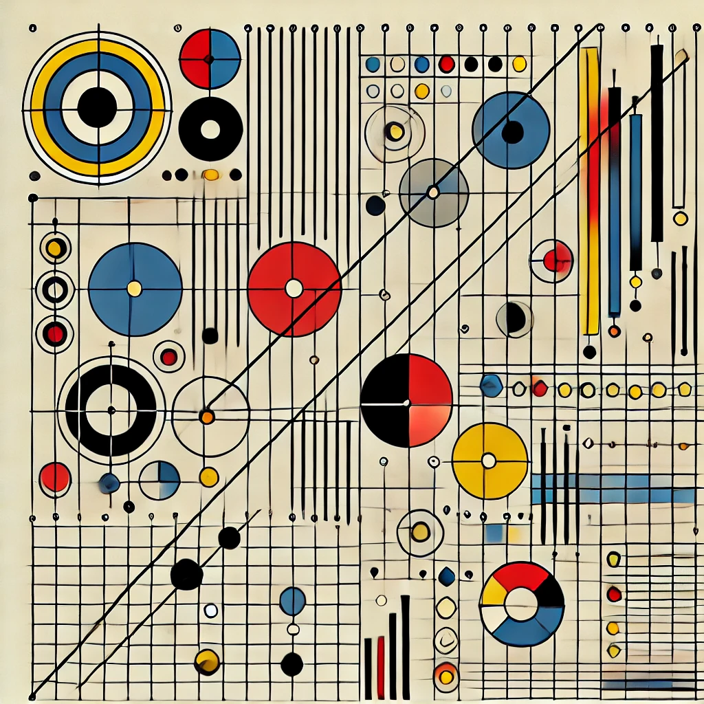

```{r Setup}
#| echo: false 
#| warning: false
#| message: false
# Load packages
library(tidyverse)
library(gt)
library(gtsummary)
library(broom)
library(estimatr)
library(modelsummary)

# ggplot2 Settings
theme_set(theme_classic())

# Define default colors
options(ggplot2.discrete.colour = c("#900000FF", "#A7B3CDFF", "#CCD7ADFF", "#676155FF", "#D4A76AFF"))

options(ggplot2.discrete.fill = c("#900000FF", "#A7B3CDFF", "#CCD7ADFF", "#676155FF", "#D4A76AFF"))


ggplot2::update_geom_defaults("point", aes(color = "#900000FF"))
ggplot2::update_geom_defaults("errorbar", aes(color = "#A7B3CDFF"))

# Define custom scale functions
scale_fill_gradient_custom <- function(...) {
  scale_fill_gradient(low = "#F9E0E0", high = "#2B1D1D", ...)
}

scale_colour_gradient_custom <- function(...) {
  scale_colour_gradient(low = "#F9E0E0", high = "#2B1D1D", ...)
}
```

## INTRODUCTION

This Quarto template is supposed to make writing and presenting economic research easy. Since everything from data to publication is happening in the same environment, everything is easily reproducible and output can be modified for the paper and the presentation at the same time.

You can for example

-   Displaying text in different forms
-   Handling images
-   Graphs that fit the aesthetic of the slides
-   Tables 1 to 3 of a standard econ project


# The various forms of displaying text in a presentation

## DIFFERENT TEXT INPUTS

You can make bullet lists with different levels

-   This looks nice and helps separate thoughts
-   But you should always have two bullets, otherwise it looks a bit weired
    -   Which to be fair one can argue about
        -   At least on the third level
-   And going back to the first level

Sometimes one might need equations. Just use *LaTeX* for this in the text to show that $2^{2} > 3$. You can also have your equation stand out like this:

$$\hat{\beta} = (X'X)^{-1} X'Y$$

## TEXT AND PICTURES SIDE BY SIDE USING COLUMNS

There is a very small (0.4%) column on the left that aligns the first context column with the headline. These type of slides are in general not much fun to produce.


::::: columns

:::: {.column width="0.4%"}
::::

:::: {.column width="44.6%"}
{width="130pt" height="130pt"}

::: {.notes-block}
**Source:** Dall-E drawing a Bauhaus style representation of the OLS mechanism.
:::
::::

:::: {.column width="55%"}


$$
\frac{\partial S(\beta)}{\partial \beta} = -2X^\top (y - X\beta) = 0
$$

$$
X^\top X \hat{\beta} = X^\top y
$$

$$
\hat{\beta} = (X^\top X)^{-1} X^\top y
$$

These equations minimize the sum of squared residuals $S$. While this seems promising, others argue that this has been done before. It is even used to health insurance risk adjustment [@reifSettingIncentivesRight2025, EJHE].

::::

:::::

## HIGHLIGHTING AND REFERENCES

Sometimes it seems that not only are people putting books from boxes but also like boxes around some highlight text. An example would be something you (can not) find in @reifSettingIncentivesRight2025 [EJHE]:

::: {.callout-note icon="false"}
## Defining an example 

Note that there are five types of callouts, including:
`note`, `warning`, `important`, `tip`, and `caution`.
:::

::: {.callout-tip} 
## Some insights 

Note and insight are the only callouts with color adjusted boxes a.t.m.
:::

## SHOW CODE AND OUTPUT
```{r program}
#| echo: true 
#| warning: false
#| message: false
# We can use code that is displayed in the output
2^2
2^2 > 3
```

# Graphs

## HISTOGRAM

:::: {#fig-hist fig-pos="h" fig-cap="Distribution of height (in cm) in random data"}
```{r Histogram}
#| echo: false 
#| warning: false
#| message: false
#| fig-width: 3.5
#| fig-asp: 0.5
#| fig-align: center
#| fig-pos: H
# Generate random data
set.seed(1234)
df <- data.frame(
  sex = factor(rep(c("F", "M"), each = 200)),
  height = round(c(rnorm(200, mean = 160, sd = 9), rnorm(200, mean = 175, sd = 10)))
)

# Make plot
ggplot(df) +
  geom_histogram(mapping = aes(x = height, fill = sex), color = "white", binwidth = 2) +
  labs(
    x = "Height",
    y = "Count",
    fill = "Sex"
  )
```
::: {.notes-block}
**Notes:** You can use this text to provide further information about the table. Nunc sed pede. Praesent vitaelectus. Praesent neque justo, vehicula eget, interdum id, facilisis et, nibh. Phasellus at purus et libero laciniadictum. Fusce aliquet. Nulla eu ante placerat leo semper dictum. Mauris metus. Curabitur lobortis. Curabitursollicitudin hendrerit nunc. Donec ultrices lacus id ipsum.
:::
::::

## BARCHART

:::: {#fig-barchart fig-pos="h" fig-cap="Number of Federal States by Country"}
```{r Barchart}
#| echo: false 
#| warning: false
#| message: false
#| fig-width: 3.5
#| fig-asp: 0.5
#| fig-align: center
#| fig-pos: H
# Get data
States <- data.frame(
  Country = c("Germany", "USA", "Brazil", "Austria"),
  value = c(16, 50, 26, 9)
)

# Make plot
ggplot(States) +
  geom_bar(mapping = aes(x = Country, y = value, fill = Country), color = "white", stat = "identity") +
  labs(y = " ") +
  scale_y_continuous(expand = expansion(mult = c(0, .1))) +
  scale_x_discrete(expand = c(0, 0)) +
  theme(
    axis.title.x = element_blank(),
    axis.ticks.x = element_blank(),
    axis.ticks.y = element_blank(),
    legend.position = "none"
  )
```
::: {.notes-block}
**Notes:** You can use this text to provide further information about the table. Nunc sed pede. Praesent vitaelectus. Praesent neque justo, vehicula eget, interdum id, facilisis et, nibh. Phasellus at purus et libero laciniadictum. Fusce aliquet. Nulla eu ante placerat leo semper dictum. Mauris metus. Curabitur lobortis. Curabitursollicitudin hendrerit nunc. Donec ultrices lacus id ipsum.
:::
::::

## TIME SERIES

:::: {#fig-ts1 fig-pos="h" fig-cap="Displaying how things evolve over time"}
```{r tsplot1}
#| echo: false 
#| warning: false
#| message: false
#| fig-width: 3
#| fig-asp: 0.5
#| fig-align: center
#| fig-pos: H
# Generate data
set.seed(123)
time <- seq(as.Date("2023-01-01"), by = "month", length.out = 12)
series1 <- cumsum(rnorm(12, 0, 1))
series2 <- cumsum(rnorm(12, 0, 1))

df <- data.frame(
  time = rep(time, 2),
  value = c(series1, series2),
  series = rep(c("Series 1", "Series 2"), each = 12)
)

# Make plot
ggplot(df, aes(x = time, y = value, color = series)) +
  geom_line() +
  labs(x = "", y = "") +
  theme(legend.position = "none")
```
::: {.notes-block}
**Notes:** You can use this text to provide further information about the figure. Nunc sed pede. Praesent vitaelectus. Praesent neque justo, vehicula eget, interdum id, facilisis et, nibh. Phasellus at purus et libero laciniadictum. Fusce aliquet. Nulla eu ante placerat leo semper dictum. Mauris metus. Curabitur lobortis. Curabitursollicitudin hendrerit nunc. Donec ultrices lacus id ipsum.
:::
::::

## SCATTERPLOT

:::: {#fig-scatterplot fig-pos="h" fig-cap="Two groups have very different values"}
```{r scatterplot}
#| echo: false 
#| warning: false
#| message: false
#| fig-width: 3.5
#| fig-asp: 0.5
#| fig-align: center
#| fig-pos: H
# Generate data
set.seed(123)
data <- data.frame(
  x = c(rnorm(50, mean = 5), rnorm(50, mean = 10)),
  y = c(rnorm(50, mean = 5), rnorm(50, mean = 10)),
  group = factor(c(rep("Group A", 50), rep("Group B", 50))),
  count = sample(1:10, 100, replace = TRUE)
)

# Make plot
ggplot(data, aes(x = x, y = y, color = group, size = count)) +
  geom_point() +
  labs(x = "X Axis", y = "Y Axis", color = NULL) +
  guides(size = "none") +
  theme(legend.position = "right")
```

::: {.notes-block}
**Notes:** You can use this text to provide further information about the figure. Nunc sed pede. Praesent vitaelectus. Praesent neque justo, vehicula eget, interdum id, facilisis et, nibh. Phasellus at purus et libero laciniadictum. Fusce aliquet. Nulla eu ante placerat leo semper dictum. Mauris metus. Curabitur lobortis. Curabitursollicitudin hendrerit nunc. Donec ultrices lacus id ipsum.
:::
::::

## DOTPLOT

:::: {#fig-dotplot fig-pos="h" fig-cap="Visualizing distributions with few observations"}
```{r dotplot}
#| echo: false 
#| warning: false
#| message: false
#| fig-width: 3.5
#| fig-asp: 0.5
#| fig-align: center
#| fig-pos: H
# Generate data
set.seed(123)
data <- data.frame(
  group = rep(c("Group A", "Group B", "Group C"), each = 20),
  value = c(round(rnorm(20, mean = 5)), round(rnorm(20, mean = 7)), round(rnorm(20, mean = 9)))
)

# Make plot
ggplot(data, aes(x = group, y = value, fill = group)) +
  geom_dotplot(binaxis = 'y', stackdir = 'center', stackratio = 1.1) +
  labs(x = " ", y = "Value", fill = NULL)
```

::: {.notes-block}
**Notes:** You can use this text to provide further information about the figure. Nunc sed pede. Praesent vitaelectus. Praesent neque justo, vehicula eget, interdum id, facilisis et, nibh. Phasellus at purus et libero laciniadictum. Fusce aliquet. Nulla eu ante placerat leo semper dictum. Mauris metus. Curabitur lobortis. Curabitursollicitudin hendrerit nunc. Donec ultrices lacus id ipsum.
:::
::::

## EVENT STUDY

:::: {#fig-eventstudy fig-pos="h" fig-cap="Coefficients relative to treatment time"}
```{r eventstudy}
#| echo: false 
#| warning: false
#| message: false
#| fig-width: 3.5
#| fig-asp: 0.6
#| fig-align: center
#| fig-pos: H
# Generate data
set.seed(42)
rel_time <- -5:5
coefficients <- c(rnorm(5, mean = 0, sd = 0.1), 0, rnorm(5, mean = 1, sd = 0.2))
std_errors <- c(rnorm(5, mean = 0.1, sd = 0.05), 0, rnorm(5, mean = 0.1, sd = 0.05))
conf_min <- coefficients - 1.96 * std_errors
conf_max <- coefficients + 1.96 * std_errors

event_study_df <- data.frame(
  rel_time = rel_time,
  coefficient = coefficients,
  std_error = std_errors,
  conf_min = conf_min,
  conf_max = conf_max
)

# Make plot
ggplot(event_study_df, aes(x = rel_time, y = coefficient)) +
  geom_errorbar(aes(ymin = conf_min, ymax = conf_max), width = 0.2) +
  geom_point(size = 2) +
  labs(
    x = "",
    y = ""
  ) +
  scale_x_continuous(labels = scales::number_format(accuracy = 1)) +
  geom_hline(yintercept = 0, linetype = "dashed") +
  geom_vline(xintercept = 0, linetype = "dashed")
```

::: {.notes-block}
**Notes:** You can use this text to provide further information about the figure. Nunc sed pede. Praesent vitaelectus. Praesent neque justo, vehicula eget, interdum id, facilisis et, nibh. Phasellus at purus et libero laciniadictum. Fusce aliquet. Nulla eu ante placerat leo semper dictum. Mauris metus. Curabitur lobortis. Curabitursollicitudin hendrerit nunc. Donec ultrices lacus id ipsum.
:::
::::

# Tables

## DESCRIPTIVES TABLE

:::: {#tbl-descriptives tbl-pos="h" tbl-cap="Descriptive statistics by group"}
```{r descriptives}
#| echo: false 
#| warning: false
#| message: false
#| tbl-align: center
#| tbl-pos: T
# Generate data
set.seed(123)
n <- 500
treatment <- rbinom(n, 1, 0.5)
female <- rbinom(n, 1, 0.5)
severity <- rbinom(n, 1, 0.4)
age <- runif(n, min = 20, max = 80)
logit_survival <- -1 + 1.5 * treatment - 2 * severity + 0.01 * (age - 50)
prob_survival <- 1 / (1 + exp(-logit_survival))
survival <- rbinom(n, 1, prob_survival)

df <- data.frame(
  treatment = treatment,
  survival = survival,
  age = age,
  female = female,
  severity = severity
)

# Make table
tbl_summary(
  df,
  type = everything() ~ "continuous",
  by = treatment,
  statistic = list(all_continuous() ~ "{mean} ({sd})"),
  label = list(
    survival = "Survival",
    age = "Age in years",
    female = "Female",
    severity = "Severity Score"
  ),
  digits = all_continuous() ~ 2
) |>
  as_gt() |>
  rm_footnotes()
```
::: {.notes-block}
**Notes:** You can use this text to provide further information about the figure. Nunc sed pede. Praesent vitaelectus. Praesent neque justo, vehicula eget, interdum id, facilisis et, nibh. Phasellus at purus et libero laciniadictum. Fusce aliquet. Nulla eu ante placerat leo semper dictum. Mauris metus. Curabitur lobortis. Curabitursollicitudin hendrerit nunc. Donec ultrices lacus id ipsum.
:::
::::

## REGRESSION TABLE

:::: {#tbl-regression tbl-pos="h" tbl-cap="Linear Regression Models"}
```{r regressions}
#| echo: false 
#| warning: false
#| message: false
#| tbl-align: center
#| tbl-pos: T
# Generate rada
set.seed(123)
n <- 500
treatment <- rbinom(n, 1, 0.5)
female <- rbinom(n, 1, 0.5)
severity <- rbinom(n, 1, 0.4)
age <- runif(n, min = 20, max = 80)
logit_survival <- -1 + 1.5 * treatment - 2 * severity + 0.01 * (age - 50)
prob_survival <- 1 / (1 + exp(-logit_survival))
survival <- rbinom(n, 1, prob_survival)

df <- data.frame(
  treatment = treatment,
  survival = survival,
  age = age,
  female = female,
  severity = severity
)

# Make table
models <- list(
  "(I)" = lm_robust(survival ~ treatment, data = df),
  "(II)" = lm_robust(survival ~ treatment + female + age + severity, data = df),
  "(III)" = lm_robust(survival ~ treatment, data = df |> filter(female == 0)),
  "(IV)" = lm_robust(survival ~ treatment + female + age + severity, data = df |> filter(female == 0)),
  "(V)" = lm_robust(survival ~ treatment, data = df |> filter(female == 1)),
  "(VI)" = lm_robust(survival ~ treatment + female + age + severity, data = df |> filter(female == 1))
)

# Format summary statistics
gm <- tibble::tribble(
  ~raw        , ~clean , ~fmt ,
  "nobs"      , "N"    ,    0 ,
  "r.squared" , "R²"   ,    2
)

# Format coefficients
cm <- c(treatment = "Treatment")

modelsummary(
  models,
  stars = c('*' = .1, '**' = .05, '***' = 0.01),
  coef_rename = c(),
  statistic = "std.error",
  gof_map = gm,
  coef_map = cm,
  escape = FALSE,
  output = "gt"
) |>
  tab_spanner(
    label = "Full Sample",
    columns = c(2, 3)
  ) |>
  tab_spanner(
    label = "Men",
    columns = c(4, 5)
  ) |>
  tab_spanner(
    label = "Women",
    columns = c(6, 7)
  ) |>
  rm_source_notes()
```
::: {.notes-block}
**Notes:** You can use this text to provide further information about the figure. Nunc sed pede. Praesent vitaelectus. Praesent neque justo, vehicula eget, interdum id, facilisis et, nibh. Phasellus at purus et libero laciniadictum. Fusce aliquet. Nulla eu ante placerat leo semper dictum. Mauris metus. Curabitur lobortis. Curabitursollicitudin hendrerit nunc. Donec ultrices lacus id ipsum.
:::
::::

# What we have learned

## LAST SLIDE

This slide will most likely be the one that the audience sees the longest. Take this into account when designing it. We could for example point out the following things: 

-   A literature slide can be at the end of your presentation, but not to show it while the audience is discussing your paper (ok, maybe if you conducted a literature review...).
-   If you present a table and say: "*Oh, this is probably a bit small*", then 1) you are probably right and 2) you could have changed it in advance. 

